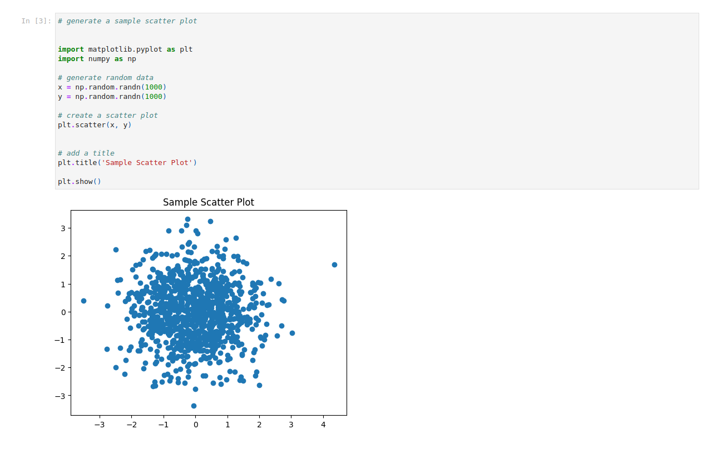

# Slideshow
A template for a markdown slideshow in VS code for academic presentations.  

See the markdown file in `./slideshows/template.md` for an example of a markdown slideshow.

Note this looks best using light themes in VS code.  

# Extensions

You'll need to install the following extensions in VS code to be able to use all the features of this template.

## Markdown based slide shows (MARP)

[MARP for VS Code ](vscode:extension/marp-team.marp-vscode)

## Mermaid based diagrams

[Markdown Preview Mermaid Support](vscode:extension/bierner.markdown-mermaid)
[Mermaid Markdown Syntax Highlighting](vscode:extension/bpruitt-goddard.mermaid-markdown-syntax-highlighting)
[Mermaid Preview](vscode:extension/vstirbu.vscode-mermaid-preview)

## Draw.io drawing inside VS code

[Draw.io Integration](vscode:extension/hediet.vscode-drawio)
[Draw.io Integration: Mermaid plugin](vscode:extension/nopeslide.vscode-drawio-plugin-mermaid)

Draw.io allows you to create diagrams and flowcharts directly in VS code. A file with the extension `.drawio.svg` (vector based) or `.drawio.png` (raster based) will be loaded by the Draw.io extension and saved as the underlying graphic format with the drawio metadata hidden in the file.  You can also use the Mermaid plugin to embed diagrams using the Mermaid syntax.

# Converting a markdown file to a slideshow

To convert a .md file to a MARP slideshow just add the following to the top of the file:

```markdown
---
marp: true
math: katex
---
```
You should also add the following to your settings.json file in VS code to be able to embed HTML elements in the slideshow and set the math rendering engine to KaTex:

```json
{
    "markdown.marp.html": "all",
    "markdown.marp.mathTypesetting": "katex",
}
```

# Getting the results of your analysis into a slideshow

You can use the `nbtools` library in this repo to export the cells of a notebook into images for use in a slideshow.  To do this you need to:

- pip install the library `nbtools`

- in a cell of the notebook add
```python
import nbtools
nbtools.export_cell_to_img('notebook.ipynb', './images')
```
- When the cell is run it will save any cell that has been tagged `export` as a .png image in the images folder

## Example


# Slideshow features

You can export the slideshow to .HTML, .PDF, or .PPTX format.  

The HTML slideshow will include a presenter feature that you can use with two monitors to see the next slide and notes on a presenter monitor and the full screen presentation on a different monitor.

The PDF slideshow will include the notes and the slides.

The PPTX slideshow will run in power point but it will render the slides as images so it won't really be easily editable.

# Issues and Questions

If you have any issues or questions please raise them in the issues tab of this repo and assign them to @khiron.