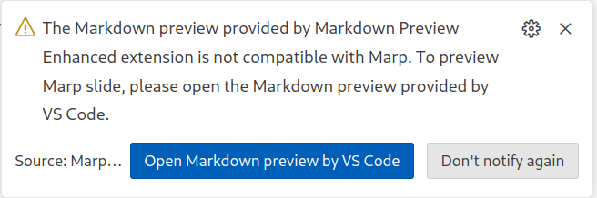

# Slideshow
A template for a markdown slideshow in VS code for academic presentations.  

Note this looks best using light themes in VS code.  

# Huttley-lab theme

To use this theme in your slideshow, add the theme name to you MARP header like this:

```
---
marp: true
theme: huttley-lab  
---
``` 

Then add the huttley-lab.css file to MARP's list of themes by hitting the `F1` key and searching for `Markdown > Marp: >Themes` and adding the huttley-lab.css' to the list.  You can also add the theme name by adding a folder .vscode to your project and adding a settings.json file as follows:

```json
{
    "markdown.marp.themes": [
        "./slideshows/theme/huttley-lab.css"
    ],
    "markdown.marp.html": "all",
    "markdown.preview.fontSize": 14,
    "markdown.preview.lineHeight": 1,
    "markdown.marp.mathTypesetting": "katex",
}
```

This code will also allow all HTML elements to be rendered in the slide show, set the font size for preview, and set the math rendering engine to KaTex.

The huttley theme adds the ability to generate 2 and 3 column layouts, automatic pagination in `slide # / total slides` format, and a cover page with the ANU logo in the bottom right.  The cover page is generated by adding the following to the top of your markdown file: 

```
<!-- _class: coverpage -->
```

# Extensions

You'll need to install the following extensions in VS code to be able to use all the features of this template.

## Markdown based slide shows

[MARP for VS Code ](vscode:extension/marp-team.marp-vscode)

## Mermaid based diagrams

[Markdown Preview Mermaid Support](vscode:extension/bierner.markdown-mermaid)
[Mermaid Markdown Syntax Highlighting](vscode:extension/bpruitt-goddard.mermaid-markdown-syntax-highlighting)
[Mermaid Preview](vscode:extension/vstirbu.vscode-mermaid-preview)

## Draw.io drawing inside VS code

[Draw.io Integration](vscode:extension/hediet.vscode-drawio)
[Draw.io Integration: Mermaid plugin](vscode:extension/nopeslide.vscode-drawio-plugin-mermaid)

Draw.io allows you to create diagrams and flowcharts directly in VS code. A file with the extension `.drawio.svg` (vector based) or `.drawio.png` (raster based) will be loaded by the Draw.io extension and saved as the underlying graphic format with the drawio metadata hidden in the file.  You can use the Mermaid plugin to embed diagrams using the Mermaid syntax.

## Markdown Preview Enhanced

[Markdown Preview Enhanced](vscode:extension/shd101wyy.markdown-preview-enhanced)

Marp doesn't like the markdown preview extension, so VS code will complain about the markdown preview enhanced extension being installed because it doesn't render individual slides in the preview.  



I ignore this because markdown preview enhanced renders mermaid code which I use a lot.  If you mostly use drawio for mermaid you can stick with VS code's built in markdown preview.
