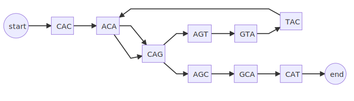

## Cover slide
<!-- paginate: skip -->
<!-- _class: coverpage -->


- Student: First Last
- Huttley lab, Australian National University
- Supervisors: Gavin Huttley 

# First slide
<!-- paginate: true -->
<!-- paginate: hold -->

- start each slide with a top level heading
- use `<!-- paginate: true -->` to turn on page numbers
- use `<!-- paginate: hold -->` to stop incrementing page numbers
- use a top level heading to create a new slide

# First slide (cont'd)

- start each slide with a top level heading
- use `<!-- paginate: true -->` to turn on page numbers
- use `<!-- paginate: hold -->` to stop incrementing page numbers
- use a top level heading to create a new slide
- **Turning off pagination allows you to progressively build up a slide without incrementing the page number**

# First slide (end)

- start each slide with a top level heading after a blank line
- use `<!-- paginate: true -->` to turn on page numbers
- use `<!-- paginate: hold -->` to pause incrementing page numbers
- use a top level heading to create a new slide
- Turning off pagination allows you to progressively build up a slide without incrementing the page number
- Usual markdown syntax applies
  - *italics* `*italics*`
  - **bold** `**bold**`
  - [links](https://www.example.com) `[links](https://www.example.com)`
  -  ``

# Second slide
<!-- paginate: true -->

- Use the draw.io extension to create diagrams and flowcharts
- Save the file with the extension `.drawio.svg` (vector based) or `.drawio.png` (raster based)
- you can display the image to the right of the text by using naming the image `bg right fit` 


# Python code

```python
def hello_world():
    print("Hello World")
```

# Mermaid diagrams

Mermaid diagrams can be created in a div HTML tag of class mermaid

```html
<div class="mermaid">
graph LR
  s((start))
  e((end))
  s-->CAC-->ACA-->CAG-->AGC-->GCA-->CAT-->e
  CAC-->ACG-->CGA-->GAG-->AGC
</div>

```

<div class="mermaid">
graph LR
  s((start))
  e((end))
  s-->CAC-->ACA-->CAG-->AGC-->GCA-->CAT-->e
  CAC-->ACG-->CGA-->GAG-->AGC
</div>


# KaTex math

$$
\int_0^\infty x^2 dx
$$

# 2 column layout

<div class="two_columns">
  <div>

## Left column

- item 1
- item 2
- item 3

  </div>
  <div> 

## Right column

- item 1
- item 2
- item 3

  </div>

# Citations

- Use KaTex to create a subscript: `$_1$`
- add a `<!-- _footer: <sub>1</sub>"[citation](DOI url)" -->` to the end of the slide to add a hyperlinked citation
- eg: pairwise alignment was described by Needleman & Wunsch in 1970$_1$

<!-- _footer: <sub>1</sub> "[Needleman & Wunsch, 1970  doi.org/10.1016/0022-2836(70)90057-4](https://doi.org/10.1016/0022-2836(70)90057-4)" -->

# PROBLEM: Exhaustive sequence alignment takes time

The order of complexity of an exhaustive alignment is given by the following 

## $O(L^n)$

Where: 
- $L$ is the average length of the sequence
- $n$ is the number of sequences

<div><div class="quote">
<p>“Big-O tells you how code <strong>slows</strong> as data <strong>grows</strong>”</p>
<cite>Ned Batchelder</cite>
</div></div>

<!-- _footer: "[nedbatchelder.com](https://nedbatchelder.com/blog/201310/big_o_log_n.html)"-->

# REFRAME: Work **increases** as data **grows**

$Work = Length^{number}$

<hr/>

| **Length (L)** | Number (n) | $Work$ |
|---|---|---|
| 1,000 | 3 | 1,000,000,000 |
| 2,000 | 3 | 8,000,000,000 |
| 3,000 | 3 | 27,000,000,000 |
| ... | ... | ... |
|10,000 | 3 | 1,000,000,000,000 |

.png)

# REFRAME: Work **increases** as data **grows**

$Work = Length^{number}$

<hr/>

| Length (L)| **Number (n)** | $Work$|
|---|---|---|
| 1,000 | 2 | 1,000,000 |
| 1,000 | 3 | 1,000,000,000 |
| 1,000 | 4 | 1,000,000,000,000 |
| ... | ... | ... |
| 1,000 | 10 | 1,000,000,000,000,000,000,000,000,000,000 |

.png)


# PROBLEM: The scale of our SARS-CoV-2 case

</br>
</br>

## The SARS-CoV-2 genome contains around **29,000** base pairs

## GISAID had over **5,000,000** sequences by Oct, 2021.

</br>
</br>


## $Work = 29,000^{5,000,000}$
</br>
</br>
</br>
</br>

## Computational work requires
</br>

## time :timer_clock: 
## money :moneybag: 
## energy :fire:

<!-- _footer: '* GISAID had 5.1M copies of SARS-CoV-2 sequences as of Oct 2021 [www.nature.com/articles/s41588-022-01033-y](https://www.nature.com/articles/s41588-022-01033-y)' -->

# 
<!-- _paginate: true -->


<!-- _footer: "Created with the Imgflip Meme Generator"-->
# 
<!-- _paginate: hold -->


<!-- _footer: "Created with the Imgflip Meme Generator"-->
# Progressive alignment

<div class="two_columns">
  <div>

### Method:
1. **start with a phylogeny**

  </div>
  <div>

## Phylogenetic tree


  </div>
</div>


# Progressive alignment
<!-- _paginate: hold -->
<div class="two_columns">
  <div>
  
### Method:
1. start with a phylogeny
1. **align the most closely related sequences**

  </div>
  <div>


  </div>
</div>


# Progressive alignment
<!-- _paginate: hold -->
<div class="two_columns">
  <div>
  
### Method:
1. start with a phylogeny
1. align the most closely related sequences
1. **align the next most closely related sequence** 

  </div>
  <div>


  </div>
</div>


# Progressive alignment
<!-- _paginate: hold -->
<div class="two_columns">
  <div>
  
### Method:
1. start with a phylogeny
1. align the most closely related sequences
1. align the next most closely related sequence
1. **Repeat until done**

  </div>
  <div>


  </div>
</div>

# Progressive alignment
<!-- _paginate: true -->
<br/>
<br/>

## Exhaustive alignment: $Work = L^n$

## Progressive alignment: $Work = (n-1)L^2$

<br/>
<br/>

## Progressive alignment is a lot less $Work$ 

# Progressive multiple sequence alignment

<br/>

### Better statistical performance 

Aligning most closely related sequences first reduces the risk of introducing errors early in the process which could propagate as more sequences are aligned.

<br/> 


<br/> 

### But you must start with the tree ... which causes 2 problems
<br/> 

# PROBLEM 1: The “Chicken and Egg” tautology
<!-- _paginate: true -->


<!-- _footer: "Created with the Imgflip Meme Generator"-->

# PROBLEM 2: Horizontal gene transfer (HGT)

<div class="two_columns">
  <div>
<br/>
<br/>


## Progressive alignment assumes one tree


  </div>
  <div>
<br/>
<br/>


## Genes encoding for Antibacterial resistance in bacteria are often transferred laterally


</div>

<!-- _footer: "Aldona, Getty Images"-->


# The problem space
<!-- _paginate: true -->

<div class="two_columns">
  <div>

Progressive MSA is sensitive to 
- The **length** of sequences to be aligned
- The **number** of sequences to be aligned
- the “ Chicken and Egg ” problem
- Horizontal gene transfer

  </div>
  <div>


</div>

# The problem space
<!-- _paginate: hold -->

<div class="two_columns">
  <div>

Progressive MSA is sensitive to 
- The **length** of sequences to be aligned
- The **number** of sequences to be aligned
- the “ Chicken and Egg ” problem
- Horizontal gene transfer

  </div>
  <div>

An ideal strategy would  
- Reduce **length** of sequences to be aligned
- Reduce **number** of sequences to be aligned
- Remove need to know the phylogeny in advance
- be resilient to Horizontal gene transfer
</div>

# The problem space
<!-- _paginate: hold -->

<div class="two_columns">
  <div>

Progressive MSA is sensitive to 
- The **length** of sequences to be aligned
- The **number** of sequences to be aligned
- the “ Chicken and Egg ” problem
- Horizontal gene transfer

  </div>
  <div>

An ideal strategy would  
- Reduce **length** of sequences to be aligned
- Reduce **number** of sequences to be aligned
- Remove need to know the phylogeny in advance
- be resilient to HGT
</div>


# What if we could **quickly** identify common regions?
<!-- _paginate: true -->


# Introducing de Bruijn graph approach


# Introducing de Bruijn graph approach
<!-- _paginate: hold -->


# Introducing de Bruijn graph approach
<!-- _paginate: hold -->


# Sequence alignment using De Bruijn Graphs

<!-- _paginate: true -->

My work builds upon the work by **Xingjian Leng**$_1$ , **Dr. Yu Lin** and **Prof. Gavin Huttley**. 


They tackled the length problem using de Bruijn graphs 


<!-- _footer: "$^1$Leng, Xingjian. ‘Sequence Alignment Using De Bruijn Graphs’. Australian National University, 2022 "-->

# Building a De Bruijn graph

##  $Work(nL)$ 

Constructing a de Bruijn graph of order 3:

<br/> 

#### Sequence


# Building a De Bruijn graph
<!-- _paginate: hold -->

##  $Work(nL)$ 

Constructing a de Bruijn graph of order 3:

<br/> 

#### Sequence


# Building a De Bruijn graph
<!-- _paginate: hold -->

##  $Work(nL)$ 

Constructing a de Bruijn graph of order 3:

<br/> 

#### Sequence


# Building a De Bruijn graph
<!-- _paginate: hold -->

##  $Work(nL)$ 

Constructing a de Bruijn graph of order 3:

<br/> 

#### Sequence


# Reducing the **length** of fragments to be aligned

|||||||||||||||
|--|---|---|---|---|---|---|---|---|---|---|---|---|---|
|Seqence A | C | A | C | A | G | T | A | C | **G** | G | C | A | T |
|Seqence B | C | A | C | A | G | T | A | C | **T** | G | C | A | T |

Projected into de Bruijn graph space


# Reducing the **length** of fragments to be aligned
<!-- _paginate: hold -->

|||||||||||||||
|--|---|---|---|---|---|---|---|---|---|---|---|---|---|
|Seqence A | C | A | C | A | G | T | A | C | **G** | G | C | A | T |
|Seqence B | C | A | C | A | G | T | A | C | **T** | G | C | A | T |

Projected into de Bruijn graph space


**“Bubbles”** appear where regions are different.

  

# Reducing the **length** of fragments to be aligned
<!-- _paginate: hold -->


can be compressed into the directed graph


**Progressive**: $Work= 14\times 14 = 196$ 
**de Bruijn graph**: $Work = 1 \times 1 =1$ 

## **196x** less “work”.  


# Taking the de Bruijn graph to the next level

<br/>
<br/>

## We have changed the length of fragments 
<br/>
<br/>

## Can we change the **number** of fragments to align?

# Reducing the **number** of fragments to be aligned

Consider this directed graph containing 4 sequences with each path shown


# Reducing the **number** of fragments to be aligned
<!-- _paginate: hold -->

Consider this directed graph containing 4 sequences with each path shown


## Sequences in bubbles can **braid** together

# Reducing the **number** of fragments to be aligned
<!-- _paginate: hold -->


## reducing length: **>8x** less work
## reducing number: **>20x** less work 


# Reduce the dependence on the phylogeny

<br/>
<br/>

## The only way to align the sequences is to

1. order bubbles by depth
2. start with deepest 
3. align bubble edges progressively


# Reduce the dependence on the phylogeny
<!-- _paginate: hold -->


# Reduce the dependence on the phylogeny
<!-- _paginate: hold -->


### .... AND SO ON

# Reduce the dependence on the phylogeny
<!-- _paginate: hold -->

<br/>
<br/>

## Progressive alignment completed without a phylogeny

<br/>
<br/>

## Depth of bubble appears negatively associated with evolutionary distance  

<br/>


# Summary

<!-- paginate: true -->

# Limitations

<div class="two_columns">
  <div>

## 1. Repeats 
## 2. Inversions and rearrangements
## 3. As sequences diverge more, the graph is expected to become more complex

  </div>
  <div>

  

</div>


# Hypotheses
<!-- paginate: true -->

<br/>

## Hypothesis 1: The bubble structure in the de Brujin graph will recapitulate the phylogeny, giving the prediction that the de Brujin graph aligner will be statistically competitive with standard progressive alignment. 


# Hypotheses
<!-- paginate: hold -->

<br/>

## Hypothesis 2: We predict that the de Brujin graph aligner will perform (statistically and computationally) better with imbalanced trees versus fully balanced ones.


# Hypotheses
<!-- paginate: hold -->

<br/>

## Hypothesis 3: de Bruijn graph alignment will be more computationally efficient than progressive alignment.


# Project aims
<!-- paginate: true -->

<style scoped>
ol {
  font-size: 1.5em; 
}
</style>

1. Algorithm development
2. Experimental validation
3. Performance evaluations, computational and statistical
4. Compare with other tools, including on real data

# Project aims
<!-- paginate: hold -->

<style scoped>
ol {font-size: 1.5em;}
</style>

1. **Algorithm development**
    - Adapt Cogent3's progressive alignment for aligning fragments
      - Determine a method to adjust emission probabilities proportionate to sequence divergence
    - Develop and implement the de Bruijn graph MSA method
<hr/>

2. Experimental validation
3. Performance evaluations, computational and statistical
4. Compare with other tools, including on real data

# Project aims
<!-- paginate: hold -->

<style scoped>
ol {font-size: 1.5em;}
</style>

1. Algorithm development
<hr/>

2. **Experimental validation**
    - Benchmarking against gold standard biological data (e.g. BAliBASE$_1$) and simulated data (e.g. AliSim$_2$)
<hr/>

3. Performance evaluations, computational and statistical
4. Compare with other tools, including on real data

<!-- _footer: "1 [doi.org/10.1093%2Fnar%2F29.1.323](https://doi.org/10.1093%2Fnar%2F29.1.323) / 2 [doi.org/10.1093/molbev/msac092](https://doi.org/10.1093/molbev/msac092)" -->

# Project aims
<!-- paginate: hold -->

<style scoped>
ol {font-size: 1.5em;}
table,td,th
 {font-size: 0.75em; }
</style>
</style>

1. Algorithm development
2. Experimental validation
<hr/>

3. **Performance evaluations, computational and statistical**
    - Simulate (AliSim$_1$, phastSIM$_2$) a range of conditions

      |parameter|min|max|
      |---|---|---|
      |**divergence**|closely related sequences|maximally divergent sequences|
      |**indel rates**|0.01% per kilobase|10% per kilobase|
      |**lengths**|viral genomes (~kbp)|microbial genomes (~mbp) |
      |**topologies**|balanced tree|unbalanced tree|
      |**sequence number**|3|1000|
<hr/>


4. Compare with other tools, including on real data
<!-- _footer: "1 [doi.org/10.1093/molbev/msac092](https://doi.org/10.1093/molbev/msac092) / 2 [doi.org/10.1371/journal.pcbi.1010056](https://doi.org/10.1371/journal.pcbi.1010056)" -->

# Project aims
<!-- paginate: hold -->

<style scoped>
ol {font-size: 1.5em; }
table,td,th
 {font-size: 0.75em; }
</style>

1. Algorithm development
2. Experimental validation
3. Performance evaluations, computational and statistical
<hr/>

4. **Compare with other tools, including on real data**
    - Compare the de Bruijn graph aligner against existing algorithms in terms of computational resources and accuracy
    - Using the following real data sets:

    |sequence type|length|count|
    |---|---|---|
    |Mammal BRCA1 gene|~3 kbp|14
    |HIV|~9 kbp|5
    |Ebola|~19 kbp|3
    |SARS-CoV-2|~29 kbp|22
    
# Thanks

<style scoped>
ul {font-size: 1.5em; }
</style>

- Gavin Huttley
- Vijini Mallawaarachchi
- Yu Lin
- Xinjian Leng

## ... and the Huttleylab


</div>

# Questions & Answers

# Citations
<!-- paginate: False -->
- [Bahr A, Thompson JD, Thierry JC, Poch O. BAliBASE (Benchmark Alignment  dataBASE): enhancements for repeats, transmembrane   sequences and circular permutations. Nucleic Acids Res. 2001 Jan 1;29(1):323–6.](https://doi.org/10.1093%2Fnar%2F29.1.323)
- Leng, Xingjian (2023), ‘Sequence Alignment Using De Bruijn Graphs’. Australian National University
- [Ly-Trong N, Naser-Khdour S, Lanfear R, Minh BQ. AliSim: A Fast and Versatile Phylogenetic Sequence Simulator for the Genomic Era. Molecular Biology and Evolution. 2022 May 1;39(5):msac092.](https://doi.org/10.1093/molbev/msac092) 
- [De Maio N, Boulton W, Weilguny L, Walker CR, Turakhia Y, Corbett-Detig R, et al. phastSim: Efficient simulation of sequence evolution for pandemic-scale datasets. PLoS Comput Biol. 2022 Apr;18(4):e1010056. ](https://doi.org/10.1371/journal.pcbi.1010056)
- [Needleman & Wunsch (1970), 'A general method applicable to the search for similarities in the amino acid sequence of two proteins'  doi.org/10.1016/0022-2836(70)90057-4, 2010](https://doi.org/10.1016/0022-2836(70)90057-4)
- [Zhao F, Zai X, Zhang Z, Xu J, Chen W. Challenges and developments in universal vaccine design against SARS-CoV-2 variants. npj Vaccines. 2022 Dec 19;7(1):1–12.](https://doi.org/10.1038/s41541-022-00597-4)


# Addendum - Increase resilience to Horizontal gene transfer 

<div class="two_columns">
  <div>


  </div>
  <div>

  </div>
</div>


# Addendum - Increase resilience to Horizontal gene transfer 


<br/>
<br/>


<div class="two_columns">
  <div>

## Bubble depth before HGT


  </div>
  <div>

## Bubble depth after HGT


  </div>
</div>

Nodes with the same number of inbound and outbound edges do not alter the order of the alignment

# Addendum - Removing cycles

