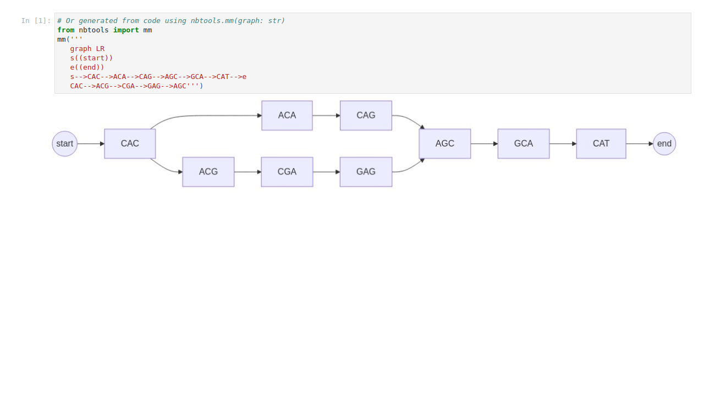

## Cover slide
<!-- paginate: skip -->
<!-- _class: coverpage -->


- Student: First Last
- Huttley lab, Australian National University
- Supervisors: Gavin Huttley 

# First slide
<!-- paginate: true -->
<!-- paginate: hold -->

- start each slide with a top level heading (ie: # some heading)
- use `<!-- paginate: true -->` to turn on page numbers
- use `<!-- paginate: hold -->` to stop incrementing page numbers
- use a top level heading to create a new slide

# First slide (cont'd)

- start each slide with a top level heading
- use `<!-- paginate: true -->` to turn on page numbers
- use `<!-- paginate: hold -->` to stop incrementing page numbers
- use a top level heading to create a new slide
- **Turning off pagination allows you to progressively build up a slide without incrementing the page number**

# First slide (end)

- start each slide with a top level heading after a blank line
- use `<!-- paginate: true -->` to turn on page numbers
- use `<!-- paginate: hold -->` to pause incrementing page numbers
- use a top level heading to create a new slide
- Turning off pagination allows you to progressively build up a slide without incrementing the page number
- **Usual markdown syntax applies**
  - *italics* `*italics*`
  - **bold** `**bold**`
  - [links](https://www.example.com) `[links](https://www.example.com)`
  -  ``

# Second slide
<!-- paginate: true -->

- Use the draw.io extension to create diagrams and flowcharts
- Save the file with the extension `.drawio.svg` (vector based) or `.drawio.png` (raster based)
- you can display the image to the right of the text by using naming the image `bg right fit`


# Python code


<div>
```python</br>
def hello_world():</br>
&nbsp;&nbsp;&nbsp;&nbsp;print("Hello World")</br>
```
</div>

```Python
def hello_world():
    print("Hello World")
```

# Mermaid diagrams

Mermaid diagrams can be created in a div HTML tag of class mermaid

```html
<div class="mermaid">
graph LR
  s((start))
  e((end))
  s-->CAC-->ACA-->CAG-->AGC-->GCA-->CAT-->e
  CAC-->ACG-->CGA-->GAG-->AGC
</div>

```

<div class="mermaid">
graph LR
  s((start))
  e((end))
  s-->CAC-->ACA-->CAG-->AGC-->GCA-->CAT-->e
  CAC-->ACG-->CGA-->GAG-->AGC
</div>

# Notebook images



Turning notebook cells into slide images;
- pip install the library `slidetools` 
- in a cell of the notebook add
```python 
import slidetools
slidetools.export_cell_to_img('notebook.ipynb', './images')
```
- When the cell is run it will save any cell tagged `export` in `notebook.ipynb` as an image in the images folder 


# KaTex math

$$
\int_0^\infty x^2 dx
$$

# 2 column layout

<div class="two_columns">
  <div>

## Left column

- item 1
- item 2
- item 3

  </div>
  <div> 

## Right column

- item 1
- item 2
- item 3

  </div>
</div

## Tables

|||||||||||||||||||
|--|---|---|---|---|---|---|---|---|---|---|---|---|---|---|---|---|---|
|*Seqence A* | C | A | T | A | C | A | G | T | A | C | **G** | T | A | G | C | A | T |
|*Seqence B* | C | A | T | A | C | A | G | T | A | C | **T** | T | A | G | C | A | T |


<!-- _footer: "[nedbatchelder.com](https://nedbatchelder.com/blog/201310/big_o_log_n.html)"-->

# Citations

- Use KaTex to create a subscript: `$_1$`
- add a `<!-- _footer: <sub>1</sub>"[citation](DOI url)" -->` to the end of the slide to add a hyperlinked citation
- eg: pairwise alignment was described by Needleman & Wunsch in 1970$_1$


<!-- _footer: <sub>1</sub> "[Needleman & Wunsch, 1970  doi.org/10.1016/0022-2836(70)90057-4](https://doi.org/10.1016/0022-2836(70)90057-4)" -->
    
# Thanks

- Gavin Huttley
- ...

## ... and the Huttleylab


</div>

# Questions & Answers

# Citations
<!-- paginate: False -->
- [Needleman & Wunsch (1970), 'A general method applicable to the search for similarities in the amino acid sequence of two proteins'  doi.org/10.1016/0022-2836(70)90057-4, 2010](https://doi.org/10.1016/0022-2836(70)90057-4)


